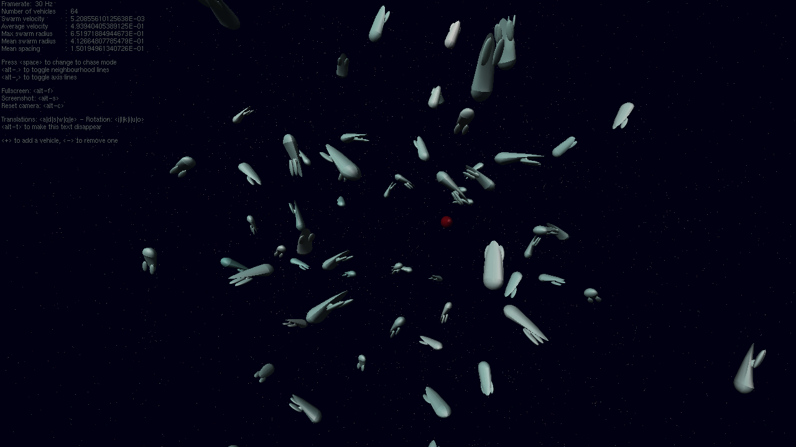
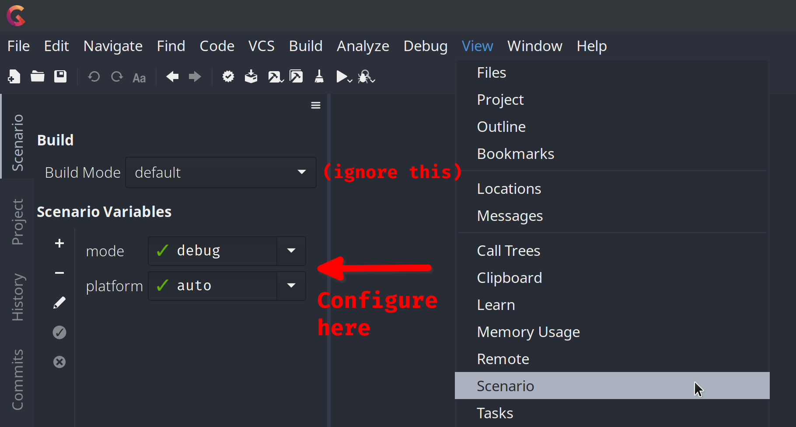

# Assignment 1: Gliding in Space

Repository for [COMP2310 assignment 1 "Gliding in Space"](https://cs.anu.edu.au/courses/comp2310/assessment/assignment1/).




## Building

### GNAT Studio

To build in GNAT Studio, do as you always have for the labs. The `Scenario` tab allows you to configure the build mode and platform (see below for description).




### Manually

To build manually, run
```
gprbuild [-jN] [-Xmode=debug|release] [-Xplatform=auto|linux|macos|windows]
```

Change the `N` in `-jN` to the number of CPU cores you want to use in building. This is not related to the number of cores the program will run on. In general, each file can be compiled independently, and `N` controls how many files can be built in parallel. If you are on Linux or macOS, you can use `-j$(nproc)` to automatically use all your CPU cores.

For example, to compile a release build on 4 cores you can run
```
gprbuild -j4 -Xmode=release
```

To remove a build, either delete `./build` or run `gprclean`.

The scenario variables are as follows
- `mode`:
    Controls the level of optimisation and runtime checks built into the program
    - `debug` (default): Build with minimal optimisation and stricter runtime checks, good for debugging and low compile time
    - `release`: Build with high optimisation and looser runtime checks, good for testing performance of a correct program


- `platform`:
    Controls how the program links with the windowing libraries. The auto option (default) should work for everyone, but a manual override is provided for unexpected circumstances.
    - `auto` (default): Automatically detect platform
    - `linux`: Build for Linux
    - `macos`: Build for macOS
    - `windows64`: Build for Windows (64 bit)
    - `windows32`: Build for Windows (32 bit)


## Running

The compiled executable is `build/<mode>/swarm`. Mode is `debug` or `release`, depending on the one you built with.

This is an example run command for debug build (Windows users must append `.exe` to executable)
```
./build/debug/swarm
```

When running through the IDE, GNAT Studio will run the appropriate program based on your current scenario variables.


### Windows users

Windows users must also either install [`freeglut` (MinGW)](https://www.transmissionzero.co.uk/software/freeglut-devel/) somewhere on the path searched for DLLs, or copy the bundled `freeglut.dll` library to the same directory as the executable you are trying to run. The bundled DLL can be found in
```
bindings/windows/lib/x86-64/dynamic/freeglut.dll
```
For 64 bit Windows make sure you use the `x86-64` version of the library. If you are using 32 bit Windows (unlikely), use the DLL in the `x86` path instead of `x86-64`.

Users have reported build errors that are solved by copying this DLL to the project root directory too, but this error does not appear on a testing Windows computer.


### Environment variables

The environment variable `SWARM_MODEL` may be set to configure the design of the spaceships. This feature is incomplete and not related to any assessed components. The valid values of `SWARM_MODEL` are secret. Explore the assignment source files if you want to find them.
